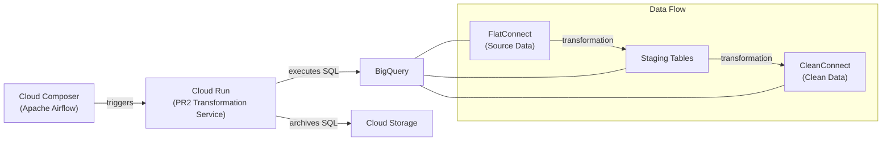

# pr2-transformation

A serverless REST API service for transforming Connect's data as part of the PR2 (investigator-facing data warehouse) data pipeline. This service runs on Google Cloud Run and processes data transformations requested by Apache Airflow orchestration.

## Overview

The PR2 transformation service converts raw Connect survey data from the `FlatConnect` dataset into clean, standardized data in the `CleanConnect` dataset. The service generates and executes SQL queries in BigQuery while archiving all SQL for audit purposes.

### Architecture



## Features

- **Column-level transformations**: Standardizes variable names, handles loop variables, removes unwanted substrings
- **Row-level transformations**: Converts binary values to concept IDs, unwraps false arrays
- **Table-level transformations**: Merges multiple versions of survey tables
- **SQL archiving**: All generated SQL is saved to Google Cloud Storage for audit trails
- **Health monitoring**: Built-in health check endpoint
- **Parallel processing**: Designed to handle multiple concurrent transformation requests

## API Endpoints

### Health Check
```http
GET /heartbeat
```
Returns service health status.

### Transform Columns
```http
POST /clean_columns
Content-Type: application/json

{
  "source": "project.dataset.source_table",
  "destination": "project.dataset.destination_table"
}
```

Applies column-level transformations including:
- One-off column renames from predefined mappings
- Substring removal (e.g., `_num`, `state_`)
- Custom column transformations
- Loop variable processing and coalescing

### Transform Rows
```http
POST /clean_rows
Content-Type: application/json

{
  "source": "project.dataset.source_table",
  "destination": "project.dataset.destination_table"
}
```

Applies row-level transformations including:
- Converting binary "0"/"1" values to concept IDs ("104430631" for No, "353358909" for Yes)
- Unwrapping false array columns (e.g., `"[123456789]"` → `"123456789"`)

### Merge Table Versions
```http
POST /merge_table_versions
Content-Type: application/json

{
  "source": ["project.dataset.table_v1", "project.dataset.table_v2"],
  "destination": "project.dataset.merged_table"
}
```

Performs full outer joins on multiple table versions with intelligent column handling:
- COALESCE for common columns
- Preservation of unique columns from each source table

## Configuration

The service uses environment variables for configuration:

| Variable | Description | Required |
|----------|-------------|----------|
| `PROJECT_ID` | Google Cloud Project ID | Yes |
| `ARTIFACT_GCS_BUCKET` | GCS bucket for SQL archiving | Yes |

The environment variables are set in Cloud Build so that they are available at build time and are passed as runtime environment variables within the cloudbuld.yaml file. 

## Data Transformations

### Variable Name Standardization

The service standardizes survey variable names following these rules:

1. **Concept ID format**: Variables should follow `d_123456789` pattern for 9-digit concept IDs
2. **Loop variables**: Handles patterns like `d_123456789_1_1` for repeated questions
3. **Version handling**: Standardizes version suffixes (e.g., `_v2`) at the end of variable names
4. **Case normalization**: Converts to lowercase except for `Connect_ID`

### Loop Variable Processing

Loop variables (questions repeated multiple times) are identified and coalesced:

```sql
-- Input columns: d_123456789_1_1, d_123456789_1_1_1_1
-- Output: 
COALESCE(d_123456789_1_1, d_123456789_1_1_1_1) AS d_123456789_1
```

### Binary Value Transformation

Binary survey responses are converted to standardized concept IDs:

```sql
CASE
    WHEN column_name = "1" THEN "353358909" -- Yes
    WHEN column_name = "0" THEN "104430631" -- No
    ELSE NULL
END
```

### False Array Unwrapping

Survey responses incorrectly stored as arrays are unwrapped:

```sql
CASE
    WHEN column_name = "[]" THEN NULL
    WHEN REGEXP_CONTAINS(column_name, r'\[\d{9}\]') 
        THEN REGEXP_REPLACE(column_name, r'\[(\d{9})\]', r'\1')
    ELSE NULL
END
```

## Development

### Prerequisites

- Python 3.11+
- Google Cloud SDK
- Docker (for containerized deployment)

### Local Setup

> *Note:* The local setup needs some work and may require some debugging. This workflow was primarily developed using local test scripts for each step, but ultimately running the pipeline end-to-end in GCP for testing.

1. Clone the repository:
```bash
git clone https://github.com/Analyticsphere/pr2-transformation.git
cd pr2-transformation
```

2. Install dependencies:
```bash
pip install -r requirements.txt
```

3. Set environment variables:
```bash
export PROJECT_ID="your-project-id"
export ARTIFACT_GCS_BUCKET="gs://your-bucket/"
```

4. Run the Flask application:
```bash
python -m flask --app core/endpoints.py run
```

### Testing

Run the test suite:
```bash
pytest
```
> *Note:* Some tests are out of date as of 5/23/25 and are therefore failing.

### Docker Deployment

Build and run the Docker container:
```bash
# Build
docker build -t pr2-transform-app .

# Run
docker run -d -e PORT=8080 -p 8080:8080 \
  -e PROJECT_ID="your-project-id" \
  -e ARTIFACT_GCS_BUCKET="gs://your-bucket/" \
  pr2-transform-app
```

Or use the convenience scripts:
```bash
# Build and run
./bin/build_and_run.sh

# Stop and remove
./bin/stop_and_remove.sh
```

### Cloud Deployment

The service is deployed to Google Cloud Run using a [Cloud Build Trigger](https://console.cloud.google.com/cloud-build/triggers;region=global/edit/55a153f7-30c1-4dd8-a0a4-10c8eabe7bba?inv=1&invt=AbyLXQ&project=nih-nci-dceg-connect-prod-6d04).

When the developer pushes to the branch configured in the trigger, a Cloud Build is automatically triggered to build the Cloud Run container and make the API available to the Airflow DAG.

## File Structure

```
├── core/                          # Core application modules
│   ├── constants.py               # Configuration constants and mappings
│   ├── endpoints.py               # Flask REST API endpoints
│   ├── transformations.py         # Main transformation logic
│   ├── transform_renderer.py      # SQL template rendering
│   ├── utils.py                   # Utility functions
│   └── request_helpers.py         # Request validation helpers
├── reference/                     # Reference data files
│   └── false_array_columns.json   # False array column definitions
├── test/                          # Test suite
├── bin/                           # Deployment scripts
├── requirements.txt               # Python dependencies
├── Dockerfile                     # Container definition
└── cloudbuild.yaml                # Cloud Build configuration
```

## Key Modules

- **`core/transformations.py`**: Main transformation logic for columns, rows, and table merging
- **`core/utils.py`**: Utility functions for BigQuery operations, column analysis, and SQL generation
- **`core/constants.py`**: Configuration constants, variable mappings, and transformation rules
- **`core/endpoints.py`**: Flask REST API endpoints that accept transformation requests

## Related Repositories

- **Orchestration**: [pr2-orchestration](https://github.com/Analyticsphere/pr2-orchestration) - Airflow DAGs for pipeline orchestration
- **Documentation**: [pr2-documentation](https://github.com/Analyticsphere/pr2-documentation) - Issue tracking and documentation

## Contributing

1. Create an issue in [pr2-documentation](https://github.com/Analyticsphere/pr2-documentation/issues) for tracking
2. Create a feature branch from `main`
3. Implement changes with appropriate tests
4. Submit a pull request referencing the issue

## Architecture Principles

- **SQL-first**: Generate SQL in Python, execute in BigQuery
- **Modularity**: Small, discrete functions optimized for readability
- **Separation of concerns**: Group transformations by type (column/row/table)
- **Auditability**: Archive all SQL queries for debugging and provenance
- **Serverless**: Stateless REST API for scalable processing
- **Configuration-driven**: Parameterize transformations to avoid hardcoding