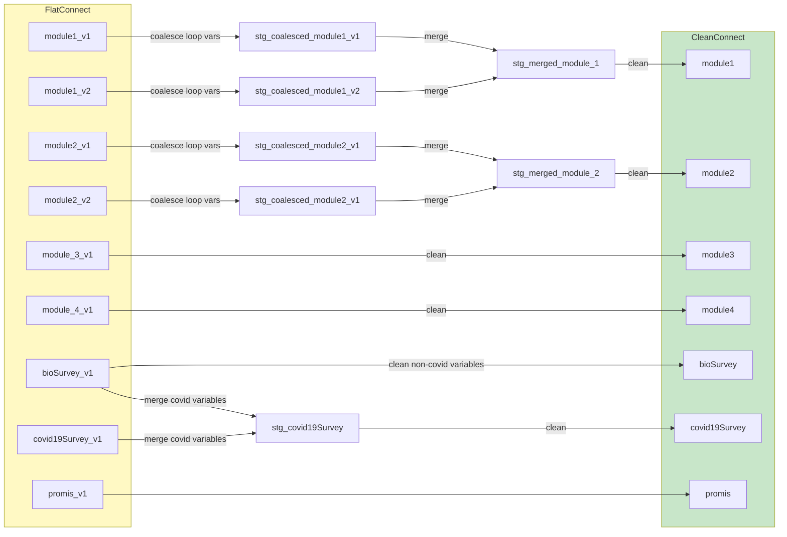

# pr2-transformation

### Workflow Diagram
## Data Flow Diagram: *FlatConnect* --> *CleanConnect*

```mermaid
flowchart LR
 subgraph FlatConnect["FlatConnect"]
        fc_mod1_v1["module1_v1"]
        fc_mod1_v2["module1_v2"]
        fc_mod2_v1["module2_v1"]
        fc_mod2_v2["module2_v2"]
        fc_mod3["module_3_v1"]
        fc_mod4["module_4_v1"]
        fc_bs["bioSurvey_v1"]
        fc_c19["covid19Survey_v1"]
        fc_prom["promis_v1"]
  end
 subgraph CleanConnect["CleanConnect"]
        cc_mod1["module1"]
        cc_mod2["module2"]
        cc_mod3["module3"]
        cc_mod4["module4"]
        cc_bs["bioSurvey"]
        cc_c19["covid19Survey"]
        cc_prom["promis"]
  end
    fc_mod1_v1 -- coalesce loop vars --> fc_coal_mod1_v1["stg_coalesced_module1_v1"]
    fc_mod1_v2 -- coalesce loop vars --> fc_coal_mod1_v2["stg_coalesced_module1_v2"]
    fc_mod2_v1 -- coalesce loop vars --> fc_coal_mod2_v1a["stg_coalesced_module2_v1"]
    fc_mod2_v2 -- coalesce loop vars --> fc_coal_mod2_v1b["stg_coalesced_module2_v1"]
    fc_mod3 -- clean --> cc_mod3
    fc_mod4 -- clean --> cc_mod4
    merge_mod1["stg_merged_module_1"] -- clean --> cc_mod1
    merge_mod2["stg_merged_module_2"] -- clean --> cc_mod2
    fc_coal_mod1_v1 -- merge --> merge_mod1
    fc_coal_mod1_v2 -- merge --> merge_mod1
    fc_coal_mod2_v1a -- merge --> merge_mod2
    fc_coal_mod2_v1b -- merge --> merge_mod2
    fc_bs -- merge covid variables --> stg_cov19["stg_covid19Survey"]
    fc_c19 -- merge covid variables --> stg_cov19
    stg_cov19 -- clean --> cc_c19
    fc_bs -- "clean non-covid variables" --> cc_bs
    fc_prom --> cc_prom
    style FlatConnect fill:#FFF9C4
    style CleanConnect fill:#C8E6C9
```
